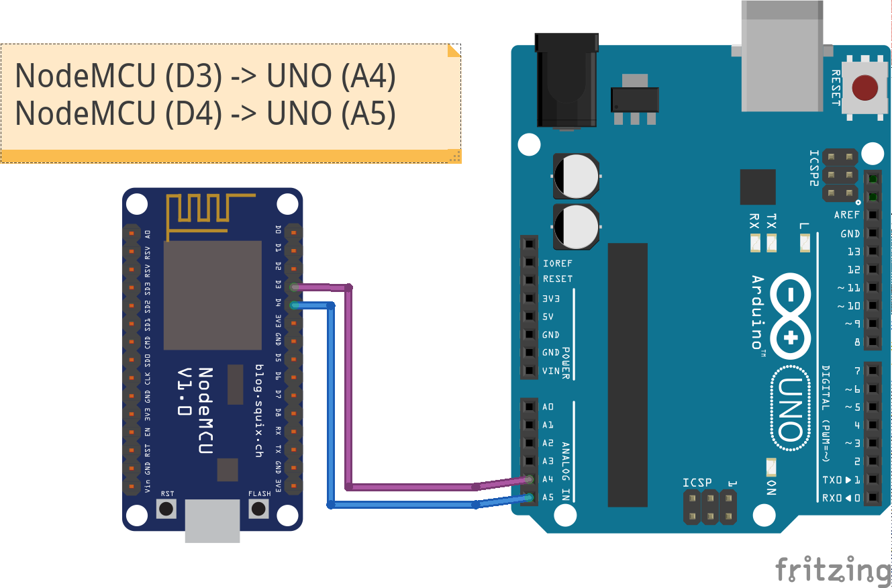

# I2C between ESP8266 and Arduino UNO

A basic example showing how to enable I2C communications between an ESP8266 (NodeMCU) and an Arduino UNO. The ESP8266 is the master and the UNO is the slave. As far as I know, the ESP8266 cannot be used as a slave.

This code is mainly based on the code written by Nicholas Zambetti <http://www.zambetti.com>.

**Warning**: The UNO is designed to work with 5.5V while the ESP8266 is designed for 3.3V. So far, I have not fried my ESP.  

## Wiring 

Connecting the two devices is done by connecting 
* UNO A4 <-> ESP8266 D3 (SDA)
* UNO A5 <-> ESP8266 D4 (SCL)

  

